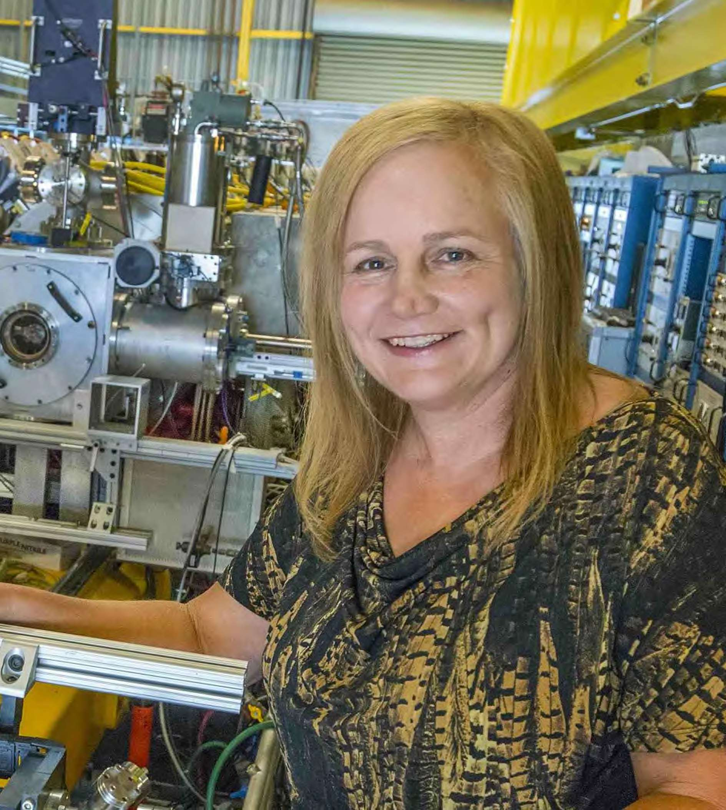
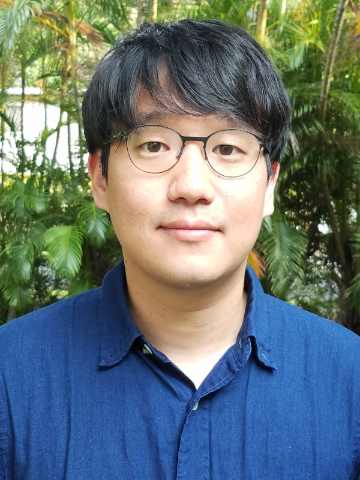
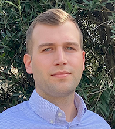

# About Us
---
## Code Groups
The Ka Mana team is a collaboration between three major code groups:

* [AMReX](https://amrex-codes.github.io/amrex/)
* [PISALE](https://pisale.bitbucket.io/)
* [MFEM](https://mfem.org/)

---
## Team Members
### PISALE Team

{width="200"}
{width="200"}
{width="200"}
{width="200"}
{width="200"}
{width="200"}

From left to right:

* Alice Koniges, UH (PI)
* Monique Chyba, UH (Co-I)
* David Eder, UH (Co-I)
* Jonghyun Lee, UH (Co-I)
* Jack McKee, UH
* Alan Tong, UH

### AMReX Team

{width="200"}
{width="200"}

* Ann Almgren, LBNL (Co-I)
* Revathi Jambunathan, LBNL

### MFEM Team

{width="200"}
{width="200"}
{width="200"}
{width="200"}

* Tzanio Kolev, LLNL (Co-I)
* Julian Andrej, LLNL
* Dylan Copeland, LLNL
* Aaron Fisher, LNLL
