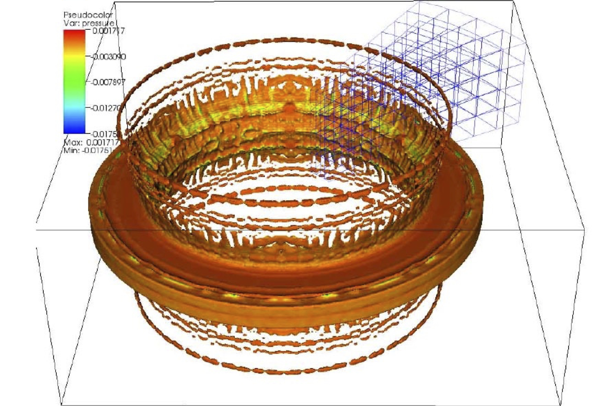

# Examples
## PISALE

Plate heated from left producing blowoff and rear surface spall. Mesh using AMR is shown in lower half of image.

A modeled hohlraum cooling ring expanding.

The impact of a steel sphere at 45 degrees on an aluminum plate.
