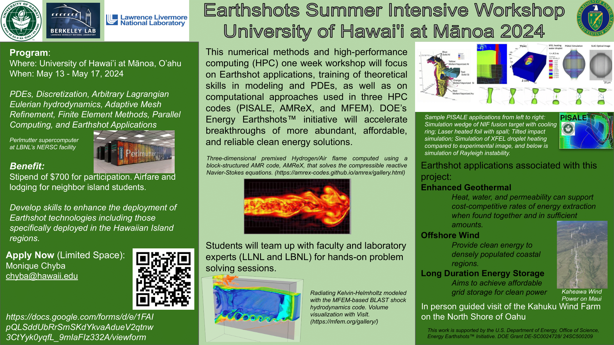
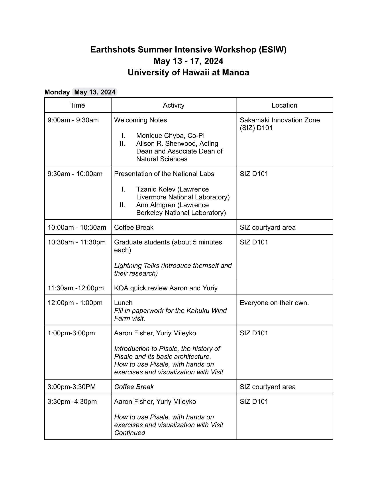
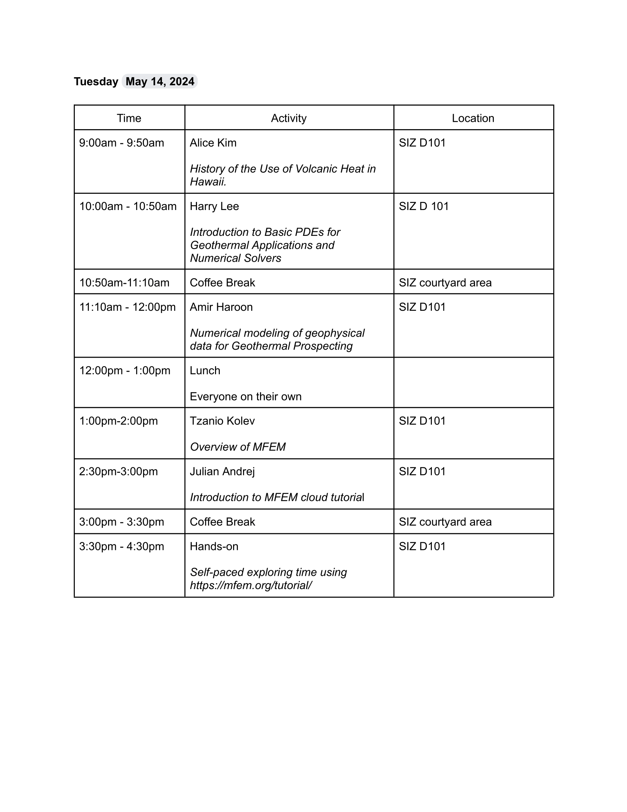
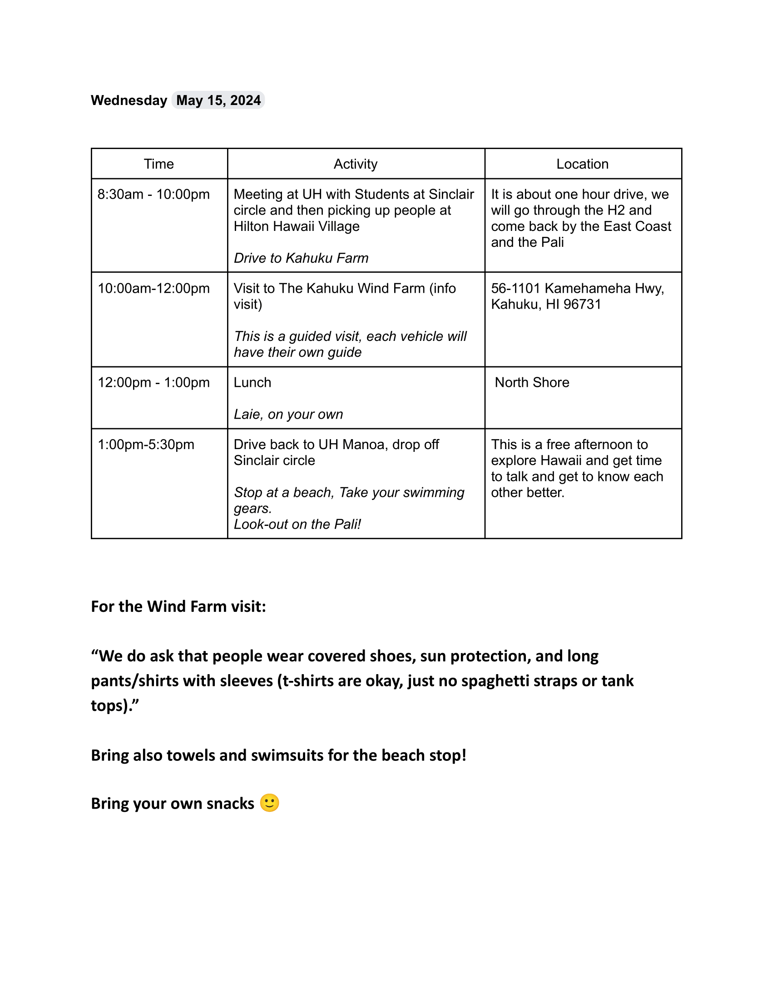
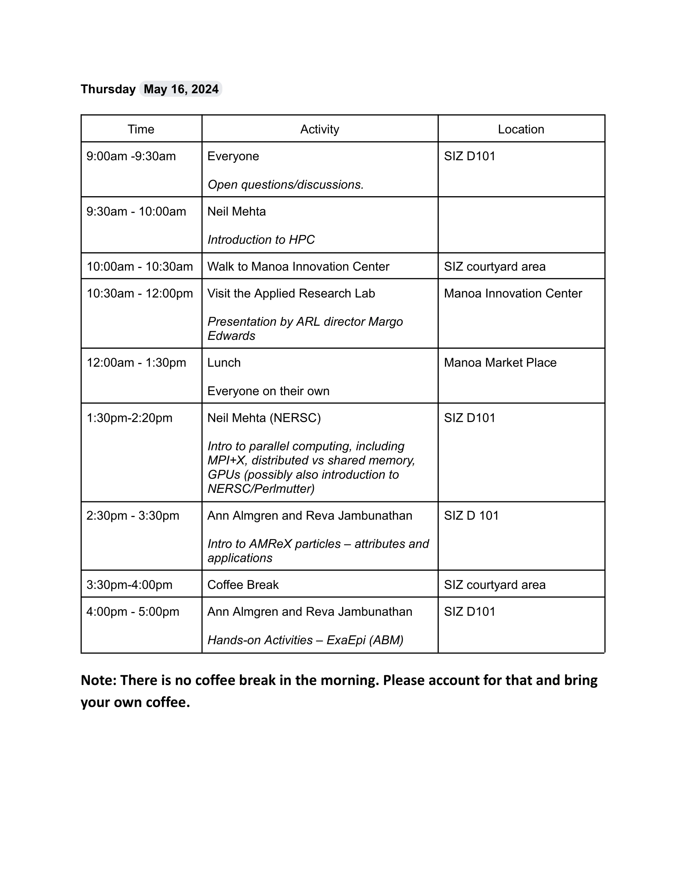
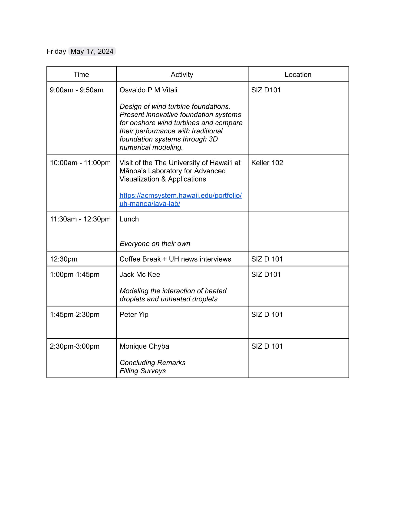

# Earthshots Summer Intensive Workshop at the University of Hawai'i
As part of the Earthshots grant, the team is arranging a numerical methods and high-performance computing workshop with a focus on Earthshots applications, theoretical mathematics, and computational mathematics. Student interns will collaborate with university faculty and computational laboratory experts to solve hands-on problem solving sessions.

In a collaboration with the UH Information Technology Service Cyberinfrastructure and HOCc cluster KOA, UH Data Sciences Institute, and UH Mānoa's Laboratory for Advanced Visualization & Applications, the first years summer workshop will take place May 13 to May 17 at the Kahuku Wind Farm on Oahu. Current student applicants have a variety of backgrounds such as engineering, atmospheric science, computer and information science, and mathematics.

# Important resources
- [A survey of Recent Applications of the PISALE Code and PDE Framework](https://drive.google.com/file/d/17qU-qEZKaXY8nIrzPzJzB1pRIa9J3950/view?usp=drive_link)
- [Early Hawaiians and Volcanic Heat](https://drive.google.com/file/d/1-QYkbGfEk0zAIjePz90D9rAy984Yug_c/view?usp=drive_link)
- [Outreach Efforts of the Hawai'i Groundwater and Geothermal Resources Center](https://drive.google.com/file/d/1pHtpadFJy9jlMZjV_b1VRAeDNTwBsVzM/view?usp=drive_link)
- [Tourists Play With Lava & Volcanic Heat](https://drive.google.com/file/d/1rFk5-rn0B6tngbKKZ_OvmFuzOjWc6X8B/view?usp=drive_link)
- [Western Explorers & Volcanic Heat in Hawaii](https://drive.google.com/file/d/131RY-AeiF6YCpFnXguMHmK1KDltImEAo/view?usp=drive_link)

# Flyer
{width = 1200}

# Schedule
{ width=800 }

{ width=800 }

{ width=800 }

{ width=800 }

{ width=800 }
